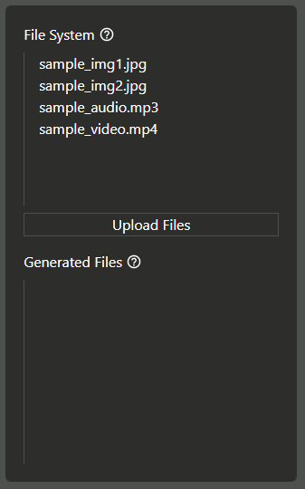

A browser based terminal to run ffmpeg with web assembly. **[ Experimental ]**

## Usage


You can run most of the ffmpeg commands on the web terminal.

Since there is no filesystem, the terminal will pick up the uploaded files from the **File System** section (see image below). By default it has some files which you can process, you can also upload your own files from your system (uploaded files are not actually uploaded to any server). The processed files will appear in the **Generated Files** section




## Setup Locally

**Note:** Make sure you have nodeJS v14+ installed.

Clone this repo

```bash
git clone https://github.com/huzaifa-99/ffmpeg-web
```

Cd into the cloned folder

```bash
cd ffmpeg-web
```

Install dependencies

```bash
yarn install
# or
npm install
```

Run the dev server

```bash
yarn dev
# or
npm run dev
```

## Disclosure

- This is an experiment of using ffmpeg with web assembly on a web based terminal just like done on a native cli.
- It uses ffmpeg web assembly ([ffmpegwasm/ffmpeg.wasm](https://github.com/ffmpegwasm/ffmpeg.wasm)) which requires SharedArrayBuffer to work. SharedArrayBuffer is disabled in most browsers from 2018 due to [Spectre](<https://en.wikipedia.org/wiki/Spectre_(security_vulnerability)>) vulnerability. These headers are sent from the server to enable SharedArrayBuffer.

```
Cross-Origin-Opener-Policy=same-origin // prevent XS-leaks, don't load cross origin documents in the same browsing context

Cross-Origin-Embedder-Policy=require-corp // prevent docs from loading cross-origin resource, only load resources from the same origin
```

- It loads ffmpeg web assembly file from the same origin (only tested on chrome desktop v103)
- For best results please only process files with size less than 1GB. You can go up to 2 GB, which is a hard limit in WebAssembly, going beyond that might break things.
- On first page load, it pulls ffmpeg web assembly from server (size ~25MB) which might make things slow and caches it (next page loads are faster).
